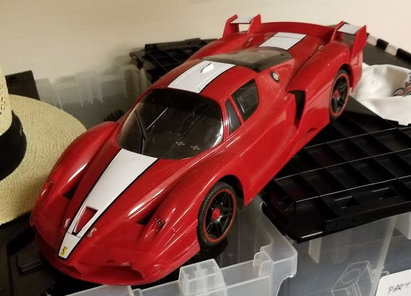
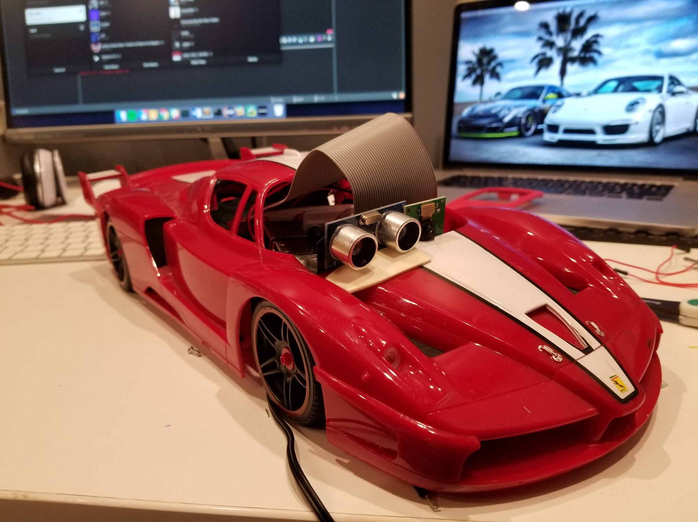

## Why Rari?

In 2011, my grandparents bought me a Ferrari remote controlled car. Yet as with many $15 RC cars bought off the streets of India, the glamorous vehicle stopped working within days.

Nearly 8 years later, I was cleaning out the garage and found the car lying with a pile of junk to be thrown away.

I completely took the car apart, and messed around with it. I had an unused Raspberry Pi at home, so I thought it would be cool to control the car using the Pi.

* * *

### About a year later, the old RC car had become a fully autonomous vehicle.

* * *

Since then, I've made the entire project open-source and simplified the process to build the car.

And the name "Rari" stuck.
