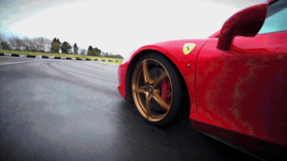

Nice work! You've already completed 1/5 of the Rari project. You're now familiar with how to use APIs and detect the contents of any image. Great work!

The next modules will explore how to create your own machine-learning scripts to do image recognition. Get hype!

