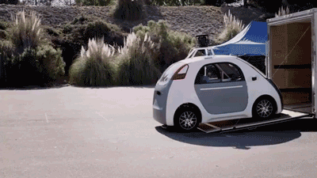

## Rari is designed for everyone.

Self-driving vehicles are today's hottest fad and tomorrow's reality! Many major companies, including Tesla, Google, and Uber, have invested millions of dollars into researching autonomous vehicle technology.

For a long time, studying this field was only possible if you were a Ph.D researcher in machine learning. But with modern resources, it's become accessible for anyone to pick up the technology and play around with it.

In this project, you will build an actual self-driving prototype! We've simplified most of the concepts so that *anyone* can build the vehicle, regardless of previous experience.

All you need is determination (and an old RC car).

## What we will be doing

We'll start by tearing apart an old remote-controlled car and installing a camera and ultrasonic sensor. Using this, we'll develop algoritms to build the "self-driving" component. We will start by achieving super basic functionality, and slowly add layers of intelligence and efficiency!

Topics we will cover:

* Google Vision APIs
* Machine Learning Algorithms
* Image Recognition
* Training neural networks

and much more!

* * *

If you're already intimidated, that's good. Rari will challenge you to grow as a computer scientist, and the material we will cover is typically taught to juniors and seniors in college!

However, our team has worked hard to ensure that you'll learn everything you need to along the way. Like we said before: if you have the determination to build something awesome, you will.

Plus, we are always here to answer questions or guide you when you need it!