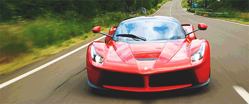

#### Rari Docs contain everything you need to know to create your own autonomous vehicle running.

## Before we get started... why rari?

In case you don't know, "rari" is short for "Ferarri."

You might have wondered why we chose Rari. Ferraris are not self-driving, they run on gas, and there's almost no relation to the project of self-driving vehicles.

True.

However, the first ever RC prototype was built by transforming a 7 year old Ferrari RC car into a self-driving machine. Since then, the name stuck.

Plus Ferarri's look pretty cool.

## What we will be doing

The purpose of the project is for you to transform an old remote-controlled car into a fully autonomous vehicle. Along the way, you will learn about the latest in self-driving technology, such as:

- Google Vision APIs
- Machine Learning Algorithms
- Image Recognition
- Training neural networks

and much more!

#### The project is designed so that *anyone* can learn these concepts quickly and easily.

If you're already intimidated, that's good. Rari will be challenge you to grow as a computer scientist, and the material we will cover is typically taught to juniors and seniors in college!

However, the team has spent hours curating content and designing this project so that it is accessible to anyone, regardless of skill level.

Plus, the team is always here to answer questions or guide you when you need it.

### Ready to push yourself? Click below!