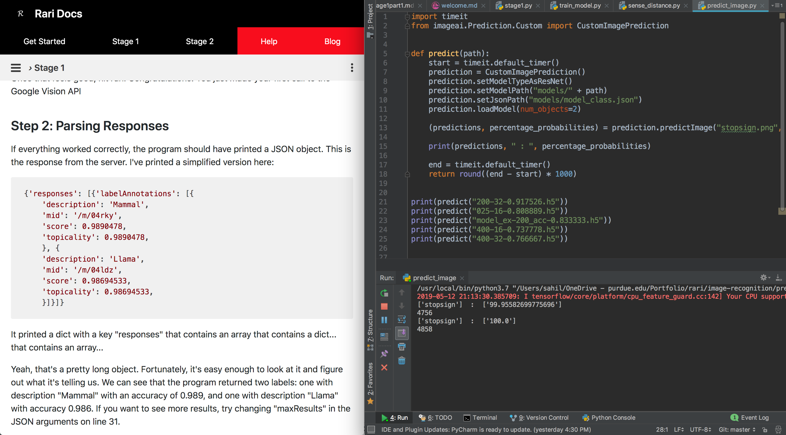

#### Rari Docs contain everything you need to know to create your own autonomous vehicle running.

## Before we get started... why rari?

In case you don't know, "rari" is short for "Ferarri."

You might have wondered why we chose Rari. Ferraris are not self-driving, they run on gas, and there's almost no relation to the project of self-driving vehicles.

True.

However, the first ever autonomous RC prototype built by the founders was a 7 year old Ferrari RC car. Since then, the name stuck.

Plus Ferarri's look pretty cool.

## What we will be doing

The purpose of the project is for you to transform an old remote-controlled car into a fully autonomous vehicle. Along the way, you will learn about the latest in self-driving technology, such as:

- Google Vision APIs
- Machine Learning Algorithms
- Image Recognition
- Training neural networks

and much more!

#### The project is designed so that *anyone* can learn these concepts quickly and easily.

If you're already intimidated, that's good. Rari will challenge you to grow as a computer scientist, and the material we will cover is typically taught to juniors and seniors in college!

However, the team has spent hours curating content and designing this project so that it is accessible to anyone, regardless of skill level.

Plus, we are always here to answer questions or guide you when you need it.

## Tips and Tricks

### 1. How to view Rari Docs

The recommended view is to have half your screen on the docs page and have open on your code editor, like this:

It doesn't have to be exactly like this, but some combination where you can see both screens at once is recommended.

### 2. If you're stuck, that's good.

Contrary to popular belief, being stuck is where you learn the most. What sets good programmers apart is not that they are "smarter" but that they are less willing to give up when they encounter a problem. Use your resources (such as the internet or the Rari team) and find the solution! Finding answers to hard problems on your own builds the most skill.

Of course, if you are truly stuck, reach out. We're here to help.

### 3. NEVER feel forced to work on Rari

If you ever feel that you are being forced to work on the project, stop right away. The goal of this project is for you to explore the fun and creative applications of computer science. That magic is torn away when you feel that you HAVE TO do it. We want you to love the work that you do!